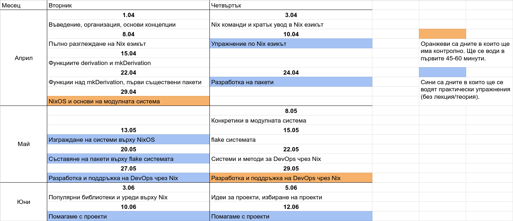

# Добре дошли!

## Кои сме ние?

Павел Атанасов - завършил бакалавър СИ @ ФМИ

Камен Младенов - 4ти курс бакалавър КН @ ФМИ

## Какво ще учим в тази академия?

- Как споделяме конфигурации?

  - Онлайн форум/блог постове с изредени стъпки.
  
    Лесно за автора, трудоемко за човекът който следва инструкциите.
  
  - shell скриптове и подобни.
  
    Лесно за потребителя: пускаш и всичко се случва.
  
    Трудно за автора: скриптовете често стават големи и лесно може да се направят фатални грешки, като [да изтриеш цялата система](https://github.com/valvesoftware/steam-for-linux/issues/3671)

---

- И в двата случая едва ли ще се поддържат всички системи

- Възможно е локални конфигурации да възпрепятстват успех

- Няма ли "вид скриптове", които

  1. се пишат лесно,

  2. отстраняват повечето възможности за грешки и

  3. работят на всяка система, без значение нейното състояние? 

# Има! Това е **Nix**

- Nix е съвкупност от програмен език, пакетен мениджър и операционна система

- Общото между всички тях е идеята за **възпроизводимост**

  - Без значение на коя система се използва

  - Без значение на каква настройка

  - Резултатът от "скрипта" е **винаги** един и същ!

- Първите идеи и разработки започват през 2003 от Eelco Dolstra

- Теоретичните основи се изграждат през 2006 от [докторската му дисертация](https://edolstra.github.io/pubs/phd-thesis.pdf)

## Употребата на Nix в реалния свят

](./repology_screenshot.png)

---

- Използва се от организации като [Google, Shopify и CERN](https://github.com/ad-si/nix-companies)
- **И можеш и ти!**

<!---

Показваме им в един терминал (във виртуалки):

1. nix-shell с програма върху Ubuntu
2. Една малка деривация, как я пускаме и леко едитваме
3. NixOS с boot-screen през който може да си избереш деривация
4. NixOS как си пускаш конфигурацията с виртуална машина

-->

# Демо

# Административно

## Контакти

- Всичката комуникация ще се извършва в дискорд сървъра ни.

- Там може да намерите организационна информация, да питате въпроси и т.н.

  { width=300px }

## Оценяване

- Ще имате **3** контролни и защита на проект

- Първите две контролни ще бъдат в началото на някои лекции

- Третото контролно ще бъде непосредствено преди защитите

- Ще ви дадем поне 2-3 седмици да разработите проекта

## Разписание

- Всеки **Вторник** и **Четвъртък** от **18:30** до **20:30** в зала 405 на ФМИ

  - Занятия започват на 01.04 и свършват на 12.06,  
    ще свършим със защити до края на Юни

  - Няма да имаме на **17.04**, **01.05**, **06.05**

---

# Въпроси?
