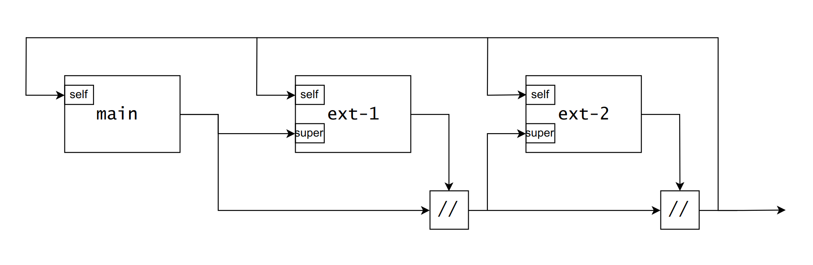

## Преговор

::: nonincremental

- Писахме NixOS конфигурации

:::

# Сегашни проблеми с възпроизводимост

- Nix се базира на идеята за възпроизводимост

- Обаче, намираме някои места където нещата зависят от потребителската конфигурация.

  1. `<nixpkgs>`
  2. `nix-build ... -A vm -I nixpkgs=channel:nixos-24.11 ...`

---

- Каналите се конфигурират на глобално ниво

- Повечето канали сочат към GitHub хранилища, към определени commit-и

- Как да вмъкнем информация за нужния канал в Nix израз?

- Вземаме идеята от езици които сме пакетирали, като Rust и Go: ще използваме lockfile-ове

# Какво е flake

- flake е **атрибутно множество** с (максимум) три атрибута:

  - `inputs` - атрибутно множество; какви неща приема flake-а (зависимости)
  - `outputs` - функция, приема `inputs` и връща атрибутно множество; какви неща връща flake-а
  - `description` - низ, който описва съответния flake

- Всяка зависимост също е flake

- Възможно е flake да няма зависимости, като [nixpkgs](https://github.com/NixOS/nixpkgs/blob/master/flake.nix), [true](https://github.com/boolean-option/true) или [false](https://github.com/boolean-option/false)

---

- Записва се във файл на име `flake.nix`

- Генерира се lockfile за всяка зависимост в `inputs`

- Ако flake-ът се намира в git хранилище, има достъп само до файловете които git track-ва

- **Експериментална система!**

# `input` формат

- Под `inputs`, всеки атрибут описва как зависимостта ще се казва (използва в нашите изрази) и от къде ще се вземе

- Има три начина по които да определим локацията на зависимост:

  1. път
  2. низ (URL-подобен синтаксис)
  3. атрибутно множество

## Път-зависимости

- Път към директория с `flake.nix` в нея

- Ако в директорията няма `flake.nix`, тогава се търси нагоре по директории

### Пример

```nix
inputs = {
  a = ./stuff/myflake;
  b = /all/another_flake_dir/subdir;
};
```

## URL-подобни зависимости

- Записват се чез под-атрибут `url`

- Използват синтаксис `TYPE:PATH`

### path URL

```nix
inputs = {
  a.url = "path:./stuff/myflake";
};
```

---

### git URL

```nix
inputs = {
  a.url = "git:./git-repos/myflake";
  b.url = "git+https://example.org/my/repo?dir=flake1";
  c.url = "git+ssh://git@github.com/NixOS/nix?ref=v1.2.3";
};
```

### github URL

```nix
inputs = {
  a.url = "github:edolstra/dwarffs";
  b.url = "github:edolstra/dwarffs/unstable";
  c.url = "github:edolstra/dwarffs/d3f2baba8f425779026c6ec04021b2e927f61e31";
  d.url = "github:internal/project?host=company-github.example.org";
};
```

# `output` формат (и V3 командите)

- Функция, която приема атрибутно множество и връща атрибутно множество

- Аргументите са всички `inputs` атрибути и атрибутът `self` (път към flake-а в `/nix/store`)

- Всички V3 команди се изпълняват върху предопределени (стандартизирани) атрибути във върнатата стойност

- Ще изучаваме формата едновременно с командите

## Примерен шаблон

```nix
{ self, ... }@inputs:
{
  packages."<system>"."<name>" = derivation;
  legacyPackages."<system>"."<name>" = derivation;
  apps."<system>"."<name>" = derivation;
  devShells."<system>"."<name>" = derivation;

  nixosModules."<name>" = { config, ... }: { options = {}; config = {}; };
  nixosConfigurations."<hostname>" = {};

  overlays."<name>" = final: prev: { };
}
```

## Как да пуснем V3 командите

1. Временно:

   ```bash
   nix --extra-experimental-features "nix-command flakes" ...
   ```

2. Постоянно - в `~/.config/nix/nix.conf` или `/etc/nix/nix.conf` се добавя:

   ```config
   experimental-features = nix-command flakes
   ```

## `packages`

- E атрибутно множество, чиито атрибутни имена съответстват на архитектурни имента: `x86_64-linux`, `aarch64-linux`, ...

- Всяка съответна стойност е друго атрибутно множество, чиито имена съответстват на имена на пакети и стойности съответстват на деривации.


## Пример

```nix
packages = {
  "x86_64-linux" = {
    mawk = stdenv.mkDerivation { ... };
    WaveFunctionCollapse = buildDotnetModule { ... };
  };
  "aarch64-linux" = {
    page_lines = writeShellApplication { ... };
    cloak = rustPlatform.buildRustPackage { ... };
  };
};
```

## `nix build`

- Можем да компилираме деривации, дефинирани в `packages` атрибута чрез `nix build`

- Автоматичо се избира архитектурата

- Всеки аргумент определя пакет който да компилира

---

- Ако не се подадат аргументи или аргументите са пътища към директории, компилира пакетът по подразбиране:

  ```nix
  packages."<system>".default = derivation;
  ```

- Също приема аргумент във формата `PATH#PACKAGE`, където
  
  - `PATH` е път към директория с flake и
  - `PACKAGE` е името на пакет (атрибут) под `packages."<system>"`

## Пример

- Нека да направим flake, който по подразбиране връща пакета `gcc` и допълнително връща пакета `fastfetch`

- Нека да вземаме пакетите директно от nixpkgs

---

### flake.nix

```nix
{
  inputs.nixpkgs.url = "github:nixos/nixpkgs/nixos-24.11";
  outputs = inputs: {
    packages."x86_64-linux".default =
      inputs.nixpkgs.packages."x86_64-linux".gcc;
    packages."x86_64-linux".fastfetch =
      inputs.nixpkgs.packages."x86_64-linux".fastfetch;
  };
}
```

### Команди

```sh
nix build               # Компилира gcc
nix build .             # Компилира gcc
nix build .#fastfetch   # Компилира fastfetch
```

## `legacyPackages`

- Работи почти като `packages`, обаче може вместо деривации да имаме атрибутни множества от деривации
  
  Името е ужасно!

- Позволява ни да направим вложени пакети, като `python312Packages.pillow`, `mate.atril`, ...

## Пример

```nix
legacyPackages = {
  "x86_64-linux" = {
    goodPrograms = {
      mawk = stdenv.mkDerivation { ... };
      page_lines = writeShellApplication { ... };
      rust.cloak = rustPlatform.buildRustPackage { ... };
    };
    WaveFunctionCollapse = buildDotnetModule { ... };
  };
};
```

## `nix run`

- Чрез `run` подкомандата, можем да компилираме **и** изпълним дадена програма

- Приема път към само една програма (един flake).
  Всички останали аргументи се подават на програмата отдолу.

---

### Команди (спрямо предходния `flake.nix`)

```sh
nix run               # Компилира и пуска gcc
nix run .             # Компилира и пуска gcc
nix run .#fastfetch   # Компилира и пуска fastfetch
```

## `apps`

- Един важен детайл: по поискано име/default, `nix run` първо проверява дали няма дефинирана `apps` стойност

- `apps` се дефинира по същия начин като `packages`, като освен деривации, атрибут-стойностите могат да бъдат "приложения" (app) от следния формат:

  ```nix
  {
    type = "app";
    program = "/nix/store/.../bin/something";
  };
  ```

## `devShells` и `nix develop`

- Дефинират се като `packages`

- Обаче идеята е всяка деривация да бъде дефиниране чрез `mkShell`

- След това използваме командата `nix develop`, за да влезем в shell със съответните настройки

## `nix develop` срещу `nix shell`

- По-общата роля на `nix develop` е да влезем в shell, който дублира средата в която пакетите се компилират

- Под версия 3 имаме и `nix shell`, чиято роля е само да влезем в shell с редица налични команди (подадени като аргументи)

- Можем да ги мислим като разбиване на `nix-shell`

## `nixosModules`

- Стойността му е атрибутно множество, където всеки атрибут е модул

- Позволява ни да разпространяваме и ползваме модули по-лесно

- Идеята е да се използват като input на други flake-ове

## `nixosConfigurations`

- Атрибутно множество, всяко атрибутно име е име на система и всеки атрибут е началния модул от който се започва конфигурация

# Overlay функции

- Чрез overlay функции можем да изменим nixpkgs

- Можем да добавяме нови програми (само в нашата конфигурация)

- Можем да изменяме програми (добавяне на patch-ове, сменяне на флагове, ...)

---

- Един overlay изглежда като:

  ```nix
  final: prev: {
    gcc = ...;
    myprogram = ...;
  }
  ```

- `final` съдържа финалните пакети (аналогично на `config` в модулната система)

- `prev` (често наименувано и `super`) съдържа пакетите от предходния overlay

---



---

- Всяка програма (в `prev`) може да бъде *презаписана*, тоест да запазим всички атрибути които експлицитно не сме пипнали:

  ```nix
  google-chrome = prev.google-chrome.override {
   commandLineArgs =
     "--proxy-server='https=127.0.0.1:3128;http=127.0.0.1:3128'";
  };
  ```

## `overlays`

- Този атрибут на `outputs` съдържа атрибутно множество с наименувани overlay функции

- Подобно на `nixosModules`, позволява ни да разпространяваме и ползваме overlay-ове по-лесно

- Целта е да се използва като зависимост на други flake-ове

# Други V3 команди

## `nix repl`

- Познаваме го, използваме го от много време

- Има силна интеграция с flake-ове - чрез `:lf` можем да вкараме `inputs` и `outputs` променливите на подадения flake

## `nix derivation`

- Показва ни в по-явен формат как изглеждат деривациите

- Удобно е за проследяване на истинските стъпки които Nix изпълнява

## `nix store`

- Еквивален на `nix-store`

- Най-важните му подкоманди за нас са:

  - `nix store gc` - пуска garbage collection
  - `nix store optimise` - пуска оптимизации (заменя копия с твърди връзки)

# Въпроси?
