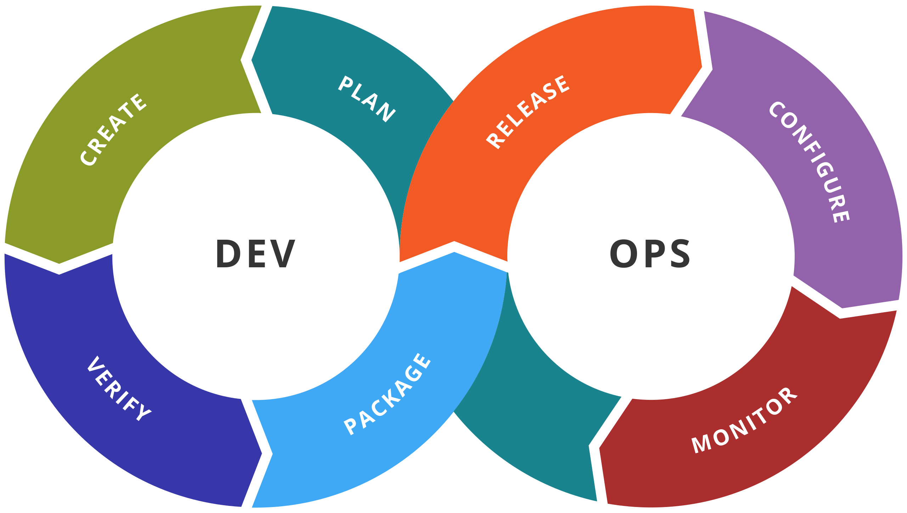

## Преговор

::: nonincremental

- Писахме flake-ове базирани на flake-parts

:::

# Какво е DevOps?

## Предистория

- От началото, софтуерната индустрия се е разделяла на две части:

  1. Development - разработката на софтуер (програмирането)

  2. Operations - менажиране, поддръжка, мониторинг на софтуер и съответната инфраструктура

- Наемани са напълно различни екипи за всяка част, работещи в изолация *(и конфликт)*

---

- Този подход позволява разработката на софтуерна система да се планира от началото, с перфектно планирани и фиксирани цели, срокове и цени.
  Ограничението идва в липсата на флексибилност и възможност за грешки.

- Много десетилетия този метод е предоставял приемливи (за бизнесите) резултати.
  Обаче в прехода от разпространение на програми в кутии и бизнес клиенти към софтуер като услуга и ежедневния човек като клиент, тази практика става недостатъчна.

---

- През 2007 се заражда идеята за DevOps: обединение на development и operations (чрез автоматизация)

- Разработчиците директно се докосват до компонентите за издаване и внедравяне на техните проекти

- Докато операторите се докосват до уредите за компилиране и тестване в съответния проект

- Но повече от всичко, **комуникацията между двете части е очаквана и нужна!**

## По-точна дефиниция на DevOps

{ height=250px }

---

- Описваме общ процес за компонент на програмата

- Създаваме компонента, верифицираме (тестваме) го, пакетираме го, публикуваме го

- След като е публикуван го конфигурираме (или по-точно го внедряваме), след това следим неговото състояние, мнения за него

- От това намираме какво да оправим, какво да подобрим, какъв да бъде следващия компонент.
  Планираме следващите стъпки и цикъла продължава.

# Как реализираме DevOps

- Всички тези идеи са добри, обаче без допълнителни уреди, единствено ще добавяме срещи между съответните екипи

- Трябва ни и технология, която позволява ефективно изпълнение

- Най-важните компоненти са **автоматизация** (чрез pipelines) и **инфраструктура като код**

## Автоматизация

- Разбиваме даден процес на малки части

- Реализираме скриптове, съответстващи на функционалността на всяка част

- Предаваме щафетата, от скрипт на скрипт\
  \
  *Звучи ли ви познато?*

- Имаме някои общоприети идеи кои процеси и на какви части да ги разбием

---

### Continuous Integration

- Под "Integration" имаме предвид интегрирането на нова функционалност в старата

- Тук разглеждаме автматизираното компилиране, верифициране и пакетиране (в частни хранилища) на функционалността

- Целим да подпомогнем разработчика

### Continuous Delivery

- Разглеждаме автоматизираното публикуване и внедряване на съответната функционалност

- Помагаме на операторите

## Инфраструктура като код

- Преди, инфраструктурата (машините, които съставят една система/сървър/организация/...) се е менажирала ръчно.
  Всеки оператор физически отива до нужния хардуер и ръчно пуска нужни скриптове или ръчно конфигурира софтуерните компоненти.

- Сега целта е да се описват общи, еднозначни конфигурации, които описват множества машини, софтуерни конфигурации в тях и техните взаимодействия\
  \
  *Звучи ли ви познато?*

# CI/CD чрез GitHub Actions

- GitHub има вградена функционалност за автоматизирани процеси

- Милиони хранилища и стотици компании използват това, включително [blocksense](https://github.com/blocksense-network/blocksense)

## Въведение в GitHub Actions

- Пишем YAML файлове в `.github/workflows` директория на нашето хранилище

- Всеки файл описва редица задачи, които трябва да се изпълнят, и кога тези задачи да се изпълнят

- Всяка задача описва редица стъпки *(скриптове)*, които трябва да се изпълнят върху определена виртуална машина

---

### Пример

```yaml
on:
  push:
    branches:
      - main
  workflow_dispatch: # Ръчно пускане

jobs:
  Cargo-Version:
    runs-on: ubuntu-latest
    steps:
      - run: sudo apt install -y cargo
      - run: cargo --version
```

## Actions

- Първи проблем: в много ситуации нужните стъпки ще се повтарят.
  Изтегляне на файлове, конфигурация на средата, ...

- Можем да напишем **action**, това е (най-често) една голяма JavaScript програма

- Извикяваме я на мястото на стъпка, вместо `run` използваме `uses`

- Можем да добвяме аргументи

---

### Пример

```yaml
steps:
  - uses: actions/checkout@v4
  - uses: rymndhng/release-on-push-action@master
    env:
      GITHUB_TOKEN: ${{ secrets.TOKEN_GITHUB }}
    with:
      bump_version_scheme: norelease
```

## Вход/изход и артефакти

- Втори проблем: как да пренесем резултатите от една задача на друга?

- Всяка задача се изпълнява в изолирана виртуална машина, която **има достъп до интернет**

- Можем да качим резултатни файлове в някакъв "облак", в една задача и да ги изтеглим в друга

- GitHub предоставят такова облачно пространство безплатно\* и наричат файловете, които ще пренесем между задачи **артефакти**

---

### Пример

```yaml
First-Job:
  steps:
    ...
    - uses: actions/upload-artifact@v3
      with:
        name: something
        path: ./path/inside/job/vm

Second-Job:
  steps:
    - uses: actions/download-artifact@v3
      with:
        name: something
        path: ./path/to/place/artifact
    ...
```

## Редица на изпълнение на задачи

- Трети проблем: `Second-Job` трябва да се изпълни *след* `First-Job`

- За всяка задача можем да предоставим `needs` -- списък със задачи, които трябва да са завършили преди текущата да се изпълни

---

### Пример

```yaml
First-Job:
  - steps:
    ...

Second-Job:
  - needs: First-Job
  - steps:
    ...

Third-Job:
  - needs: [ First-Job, Second-Job ]
  - steps:
    ...
```

## Actions таб над хранилища

- Всяко GitHub хранилище (в което е включено) съдържа специален таб/подстраница на име "Actions"

- В нея се вижда, за всеки workflow файл, всяко негово изпълнение и данни за изпълнението вътре

- Нека да разгледаме този на [blocksense](https://github.com/blocksense-network/blocksense/actions)

# DevOps в Nix

- Нямаме време да разгледаме всичко (и не всичко е напълно решен проблем)

- Ще разгледаме само най-основното

## Популярни библиотеки

[nixops4](https://github.com/nixops4/nixops4)
: Автоматизиран deployment на NixOS машини в мрежа или облак

[terranix](https://terranix.org/)
: Дефиниране на [Terraform](https://developer.hashicorp.com/terraform) конфигурации (IaC) през Nix

[deploy-rs](https://github.com/serokell/deploy-rs)
: Автоматизиран deployment на Nix flake-ове

[colmena](https://github.com/zhaofengli/colmena)
: Модерен автоматизиран deployment на NixOS машини

# Ръчен DevOps чрез Nix

## Как Nix се включва в DevOps фазите?

\centering
{ height=140px }
\raggedright
\flushleft

- Създаването на Nix пакети и модули можем да зачитаме като автоматизацията върху фазите "Create", "Verify", "Package"

- Създаването на NixOS конфигурации можем да зачитаме за автоматизацията на "Configure" фазата

---

- "Plan" и "Monitor" не можем много да автоматизираме, и към момента се използват уреди извън Nix

- Остава "Release", от една страна, разпространение на самия Nix код може да се зачете за публикация

- Но това което ни липсва е "deployment", нашия Nix код да се постави в нужните машини/сървъри/...

## nixos-rebuild

- Използвахме го в [упражнението върху flake-ове](https://github.com/universal-configurations-with-nix/academy-2025/blob/main/slides/12-exercises-flakes.pdf), за да компилираме виртуални машини спрямо NixOS конфигураци (`nixos-rebuild build-vm`)

- Освен това можем да изпълним и `nixos-rebuild switch`.
  Тази команда:

  1. Компилира системната конфигурация
  2. Добавя я в root-овете (т.е. да не се изтрива по подразбиране)
  3. "Активира" я (прилага всички възможни промени без да рестартира компютъра)
  4. Добавя референция в bootloader-а

---

- Към `nixos-rebuild switch` можем да добавим и аргументите `--target-host` и `--build-host`

- Първия ни задава към коя машина (по подаден `[USER]@[ADDRESS]`) да изпълним действието

- Втория посочва коя машина ще извърши компилацията на конфигурацията

- Ето така ще реализираме "deployment"

# Демо

- Имаме две машини на адреси A и B

- В едната се е пуснал сървис X

- В другата се е пуснала [grafana](https://grafana.com/) -- уред за monitoring -- конфигурирана да следи сървис X

# Въпроси?

## Признания

DevOps изображение\
Kharnagy - Own work, CC BY-SA 4.0, <https://commons.wikimedia.org/w/index.php?curid=51215412>
